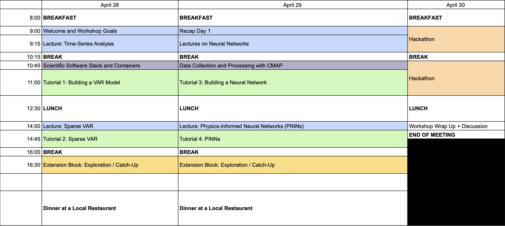

# ml_cbiomes

Materials for the *Machine Learning for Time-Series Data* CBIOMES workshop.

This repository contains tutorials, datasets, and setup instructions for the workshop.

---

## Before the Workshop

Please complete the setup steps below and verify that everything is working.

If you are unable to complete any of these steps, please contact the event organizers.

---

## Setup

We will use a pre-built Docker container with all required dependencies for the workshop.

**Follow the full setup instructions here:** [`containers.md`](containers.md)

In summary:

1. Install Docker Desktop  
2. Pull the workshop image: `powellb/cbiomes-ml:2026`  
3. Clone this repository  
4. Run the container and open JupyterLab (e.g., http://localhost:8900)

Then test your setup by running:

`linear_regression_example.ipynb`

If you encounter issues, please contact the event organizers.

---

## Simons CMAP API Key

Some tutorials require access to the Simons CMAP database.

1. Go to [Simons CMAP](https://simonscmap.com/)
2. Log in or create an account
3. Click on **Documentation** in the top menu
4. Select **API Key**
5. Click **Generate API Key**
6. Save your key for use during the tutorials.

You will use this key to access CMAP data via Python (`pycmap`).

We recommend completing this step before the workshop begins.

---

## Repository Structure

This repository will be updated as workshop materials are finalized.  
Please pull the latest version before Day 1 and during the workshop as needed.

- `tutorials/`: Step-by-step notebooks and exercises  
- `data/`: Datasets used in tutorials and for exploration

---

## Workshop Schedule

