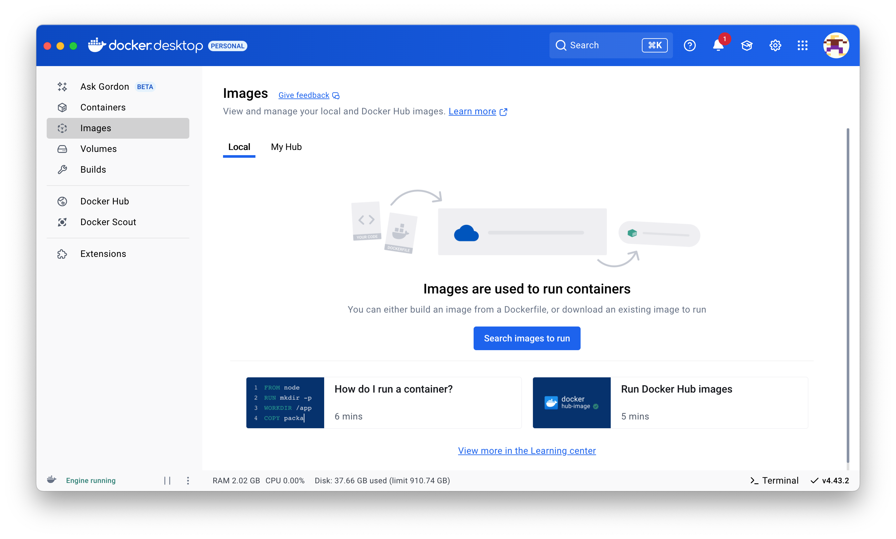
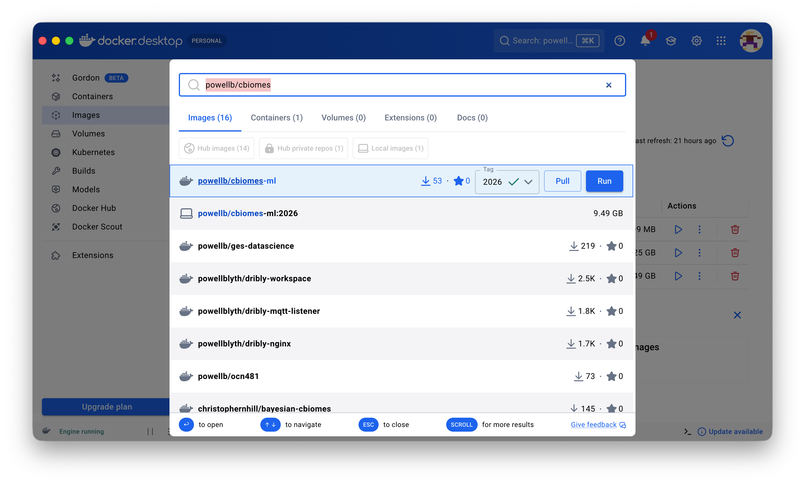
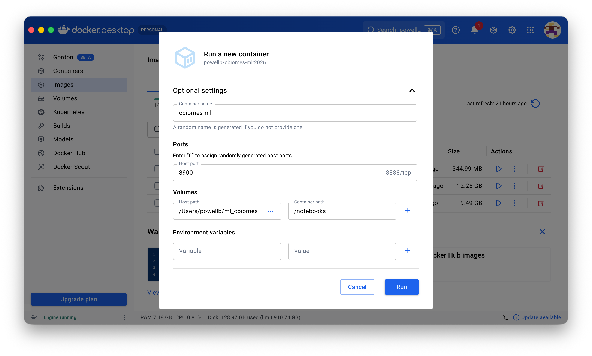
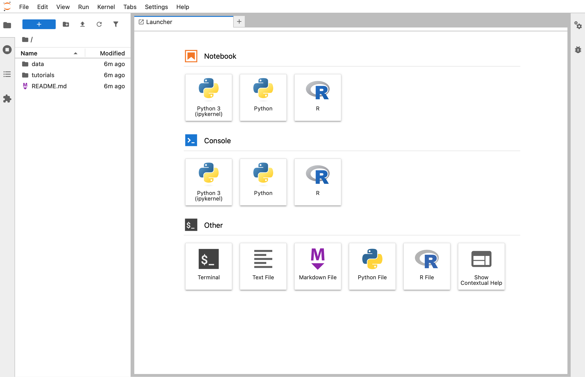
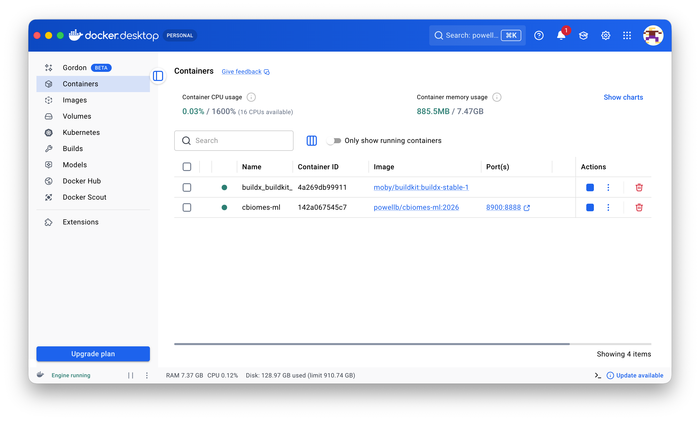

# Installing the Workshop Container

## Scientific Reproducibility

The fundamental requirement of science is that results are reproducible; however, with the modern software stack and complexity, it has become nearly impossible to reproduce the work of others (or even yourself after a couple of years or upgrading a machine). To solve this problem, we turn to a technology that has been used for over a decade in the software development realm: containers.

Containers contain all of the necessary software for a given workflow. For instance, it may contain Python with all of the packages needed for your work. This is now a fixed snapshot that is permanent. You can share this container with anyone, and they can use the exact environment you used. You can have different containers for different projects, and you will be able to recreate your work at any time in the future.

Containers are supported natively by modern ARM, Intel, and AMD processors. These are similar to a virtual machine that is running as a tier-one OS on your machine, but they are more akin to a program on your native OS. Containers power Amazon Web Services, Microsoft Azure, and many, many more technologies. Nearly every website you access is likely running in a container.

Containers are also supported natively by the major OS releases. Windows Subsystem for Linux (WSL) is simply a convoluted name for containers. On macOS, the `container` command-line package implements them. On Linux, `podman` and others provide support.

One of the easiest ways across all OS distributions to utilize containers is with the Docker software. If you already have your own container software, and are experienced with it, feel free to install the [workshop container](https://hub.docker.com/repository/docker/powellb/cbiomes-ml/general) yourself (`docker pull powellb/cbiomes-ml:2026`).

## Docker Container

Docker Engine is an open-source project to allow you to manage applications as portable, self-contained containers. A container encapsulates all of the software needed to run whatever it is you want to do. So, in our case, the container will have R, Python, Jupyter Server, and all of the software needed to make it work. It is self-contained, so it will work on any machine: macOS, Windows, or Linux without any change to the user. This allows you to run the *exact* environment as everyone else for this workshop without having to configure or set it up. It does require that you install the [Docker Desktop](https://www.docker.com/products/docker-desktop/) application so you can run the container.

To use Docker, the first thing is to [install the Desktop application](https://docker.com). You will need to choose the correct installer for your machine. If you have previously installed Docker Desktop, launch it and make sure it is updated to the latest version, and you can skip to the next section.

To install, follow the simplified installation instructions in this document. For detailed installation and help with specific issues, you can follow instructions for each type of machine:

-   **[macOS](https://docs.docker.com/desktop/install/mac-install/):** NOTE: make sure to select the correct type, Apple Silicon (after 2021) or Intel (machine prior to 2021)
-   **[Windows](https://docs.docker.com/desktop/install/windows-install/):** NOTE: you will be forced to restart your computer
-   **[Linux](https://docs.docker.com/desktop/install/linux-install/):** NOTE: there are different instructions for various distributions

When you first run the Docker Desktop, it will likely ask you to log in. I recommend that you choose the small `Skip` link (it will be insistent, just keep clicking `Skip`). If you want to register, feel free. Either way, it will not make a difference for this workshop.

Once you have the Desktop running, you should see a screen similar to this:

If you&rsquo;ve just installed Docker, you do not have any available images. An *image* is what the container is crated from, and this lists those images available on your computer. Once we have an *image* available, we will create a *container* that a local instance of that *image*.

## Install the Workshop Image

The Docker Desktop has installed everything we need to continue. Now we need to install the image I have built for this class that has everything you need for the class. Click &ldquo;Images&rdquo; tab on the left so that we are in the Images pane.

Type `powellb/cbiomes` in the search bar at the top of the window to search for available images, then find the `powellb/cbiomes-ml` item in the search results. Once you find the item, as your pointer moves over it, it will show three items. First, make sure that `2026` tag is chosen in the pop-up menu and click the `Pull` button. If you click on the item, it should open to a panel that shows the download progress. It will take some time to download (NOTE: you should have at least 12GB of free disk space on your computer).

While it is downloading, you should clone the workshop github onto your local machine. The github directory is going to be shared with the container so that you will have all of the files for the workshop, you can add files, use them in the container, and the container will save its files there. Because the container cannot access your machine on its own, it needs this directory so you can do your work, save it, and submit it.

## Configure the Workshop Container 

Once Docker Desktop has completed downloading the workshop *image*, you are ready to create a new *container* that you will use for the workshop. Click the `Run` button (NOTE: if it is still showing the display where it was downloading, there is a `Run` button). If it is showing the list of images you have downloaded, there will be a play icon &ldquo;▶&rdquo; instead. Once you click to Run, it will present a dialog to allow you to set the configuration for the workshop. Click `Optional Settings`, and fill it out as shown below.

For the `Container name`, I recommend you call it `cbiomes-workshop`, but it is not required. For `Host Port`, enter a number for an unused port on your machine, typically `8900`. This number is important as it is how your web browser will connect to Jupyter Lab running in the *container*. Next is also crucial. Under `Volumes`, we need to connect the github directory you just created above to a directory in the *container* so that you can load and save your work. Click the three dots `…` icon in the `Host path`, and then your computer&rsquo;s file dialog will appear. Navigate to and select the folder you cloned. In the `Container path`, you will need to type `/notebooks` as that is the directory in the container that the Jupyter Lab will work with. Once completed, click `Run`.

On Windows, you will be prompted with a dialog asking: &ldquo;Do you want to allow public and private networks to access this app?&rdquo; Click `Allow`. This is the only time it will bother you.

To verify it is working, click <https://localhost:8900> (use whatever number you specified when you set the Run parameters above) to open the Jupyter Lab in your browser. You should be presented with a screen like the one below.

You are all set and ready to start with the first assignment.

## Working with Docker

Once you complete the above, your docker *container* is running. There will be times that you power down or restart your computer, or you want to stop the *container* from running because you won&rsquo;t be using it. On the Docker Desktop, the default view is the `Containers` tab. It lists the containers you have created and their status (running, etc.).

As shown, it lists the *container* name (the name you assigned when you created it, or a random name if you didn&rsquo;t assign like this one), the *image* it was created from `powellb/ges-datascience`, and its status (Running or Exited). If it is Running, you can click the Stop Button &ldquo;⏹&rdquo; in the `Actions`, or if it has Exited, you can start it with the play &ldquo;▶&rdquo; button.

**NOTE:** stopping the container will shut it down. If you haven&rsquo;t saved your notebook(s), you will lose what you haven&rsquo;t saved. Make sure to save your work prior to stopping a container.

## Building your own Container Image

If you are interested in how to build your own container for future work, the [Dockerfile](Dockerfile) in the github is the script that generated the image for this workshop.

